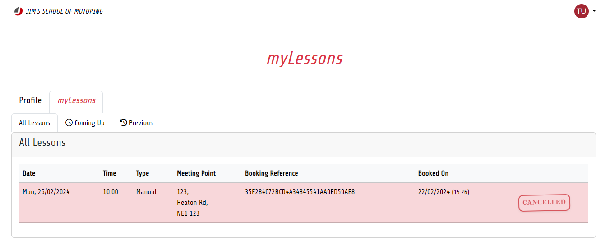
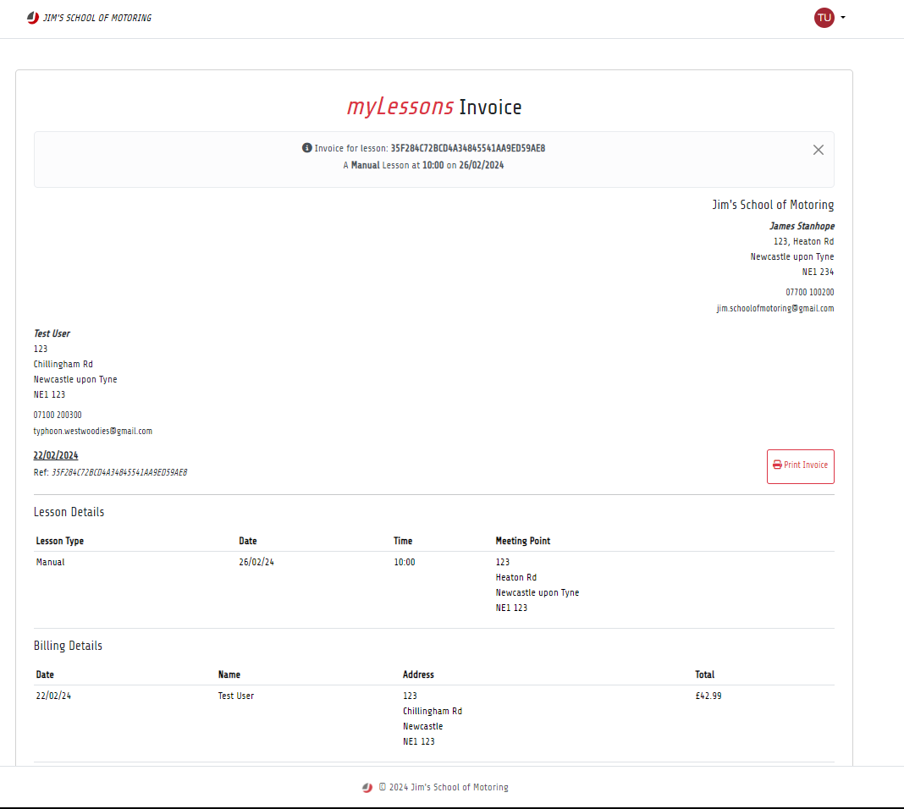

# Contents

1. [Milestone Project 4](#milestone-project-4)

    i. [Assessment Criteria](docs/assessment_criteria.pdf)

    ii. [Project Brief](#project-brief)
    
    iii. [Main Technologies](#main-technologies)

2. [About](#about)

3. [Design Phase](#design-phase)

4. [UX](#ux)

    i. [Application Goals](#application-goals)

    ii. [User Stories](#user-stories)

5. [UI](#ui)

    i. [Design Choices](#design-choices)

    ii. [Wireframes](#wireframes)

    iii. [Site Map](#site-map)

6. [Application Features](#application-features)

7. [Accessibility](#accessibility)
    
    i. [Google Lighthouse](#google-lighthouse)

8. [Version Control](#version-control)

    i. [Git & GitHub](#git--github)

9. [Debugging](#debugging)

    i. [Error Handling](#error-handling)

10. [Testing](#testing)

    i. [Test Environment](#test-environment)

    ii. [Manual Testing](#manual-testing)

    iii. [Automated Testing](#automated-testing)

    iv. [Code Validation](#code-validation)

11. [Deployment](#deployment)

    i. [ElephantSQL](#elephantsql)
    ii. [Amazon Web Services (AWS)](#amazon-web-services-aws)
    iii. [Heroku](#heroku)

12. [References & Acknowledgements](#references--acknowledgements)

    i. [Code](#code)

    ii. [Media](#media)

    iii. [Icons](#icons)

    iv. [Fonts](#fonts)

## Milestone Project 4
This project is my submission for Milestone Project 4: Full Stack Frameworks with Django. The final project for the Level 5 Diploma in Web Applications Development.

### [Assessment Criteria](docs/assessment_criteria.pdf)

### Project Brief

1. Django Full Stack Project

    - Build a Django project backend by a relational database to create a website that allows users to store and manipulate data about a particular domain. 

2. Multiple Apps

    - The project must be a brand new Django project, composed of multiple apps (an app for each potentially reusable component in the project).

3. Data Modelling

    - Put some effort into designing a relational database schema well-suited for the domain. Make sure to put some thought into the relationships between entities. Create at least two custom Django models beyond the examples shown on the course. 

4. User Authentication

    - The project should include an authentication mechanism, allowing a user to register and log in. There should be a good reason as to why the user would need to do so.

5. User Interaction

    - Include at least one form with validation that will allow users to create and edit models in the back-end (in addition to the authentication mechanism).

6. Use of Stripe

     - At least one of the Django apps should contain some e-commerce functionality using Stripe. This may be a shopping cart checkout or single payments. After paying successfully, the user would gain access to additional functionality/content on the site. Not that for this project, Stripe's test functionality should be used, rather than actual live payments.

7. Structure and Navigation

    - Incorporate a main navigation menu and structured layout. This could be achieved using Bootstrap, for example.

8. Use of JavaScript

    - The front-end should contain some JavaScript logic which enhances the user experience.

9. Documentation

    - Write a README.md file that explains what the project does and the value it provides to its users.

10. Version Control

    - Use Git and GitHub for version control.

11. Attribution

    - Maintain a clear separation between code written by oneself and code from external sources. Attribute any code from external sources to its source via comments above the code or for larger dependencies, in the README.

12. Deployment

    - Deploy the final version to a hosting platform such as Heroku.

13. Security

    - Make sure not to include any passwords or secret keys in the project repository. Make sure to turn off the Django DEBUG mode which could expose secrets.

### Technologies Used

#### Languages

- HTML
- CSS
- JavaScript
- Python

#### Frameworks

- Django 3.2 (LTS Version)
- Bootstrap 5

#### Libraries

- jQuery
- Bootstrap 5
- FontAwesome Icons
- Google Fonts

#### APIs

- Amazon Web Services (AWS)
- S3 Bucket
- Google Sheets API

#### Data & Databases

- JSON
- SQLite
- PostgreSQL
- ElephantSQL

#### Security & Authentication

- Django Allauth
- IAM (AWS & Google)
- Google OAUTH 2.0

#### Version Control & Deployment

- Git
- GitHub
- Heroku

# About

This website is for "Jim's School of Motoring" a fictional driving school which uses it's online platform to manage learner driver's lesson bookings and collect payments.

The site is centered around user profile functionality. In this way, it provides an online portal allowing learners to register for an account to be able to book their lessons online. When a user books a lesson, they can view the details at any time from their profile.
User profiles can be updated at any time by editing individual personal details such as address, telephone number etc. This ensures details associated with the booking are up to date.

The booking process queries the database to only display the dates and times that are available (not already booked) and will save the user's booking to the database if their payment details are validated by Stripe and the payment is successful.

To view a live preview of the site, simply navigate to the domain address hosted by Heroku: https://jims-school-of-motoring-19a5b545c631.herokuapp.com/

# Design Phase

## UX

### Site Goals

#### 1. Booking System

Design, develop and deploy a booking system which is effective in taking learners' bookings.

- Collect the learners' details from their user profile.

    - The booking system will need to query the user's profile to retrieve this data and assign it to the booking so that each booking is associated with the user who made it.

        - The idea behind this approach is that it will save the user time if they only have to fill out their details once when initialising their profile instead of manually inputting it in the form each time they want to book a lesson.

    - These details must already be populated fields in the database before a booking can be made, therefore appropriate error handling and user feedback to prompt the user to complete their profile needs implementing if that is not the case.

- Display a selection of dates and times that are available to book.

    - The booking system will need to query the booking database model to only display dates and times that have not already been booked.These will need to be displayed to the user for selection in an intuitive and easy to read format.

        - Dates will need to be displayed having been reformatted from the SQL database datefield: 'MM/DD/YYYY' (e.g. 02/22/2024) to 'd, DD/MM/YYYY' (e.g. Thurs, 22/02/2024) since this site is aimed at users in the UK.

        - The user selection needs to be easy to navigate and to select the desired date and time. This could be developed using either a select dropdown displaying only the available dates and times or even a datepicker with the unavailable date/time options disabled.

- Save and store user's selection prior to payment and booking creation.

    - The user's selection will need to be stored somewhere to be accessed upon checkout and prior to booking creation.
    This data should be posted to and stored in the Django session storage until the user decides to checkout. Upon successful checkout, the booking system form will collect the user's selection and delete it from session storage.

- Price Model
    - Create a separate model for the lesson price.
        - The price model will include a unique decimal field for staff/admin to edit and update the lesson price should they need to.
        - Only one instance of lesson price is allowed.
            - Lesson prices can be edited and updated by those with permission but further instances can not be created.
    
    - The price field in the Booking model needs to be a foreignkey object of the Price model. This ensures any booking made will have the updated price charged to it.
        

- Take payment via Stripe

    - Payments for bookings will be taken via Stripe's API.

    - A payment intent will need to be created for each payment and assigned a unique client ID. For staff/admin reference, the payment intent id will be saved to the booking to allow for quick and easy querying inside Django admin or Stripe Dashboard.
    From Stripe dashboard, payments can be viewed, amended and refunded.

    - Make use of secure Stripe Webhook functionality to mitigate user/server error to prevent mischarges, fraud attempts and diagnose faults in the payment and data collection process.

- Booking Creation

    - The booking form will need to be validated to ensure the data it collects is in the format the database is expecting to receive and is valid and no essential data is null. If not valid, appropriate error handling and user feedback must be implemented and payments must not be taken without a booking being made.

    - The booking model should automatically generate a UUID booking reference for each instance created. It should also auto-add the date and time the booking was made.

- Checkout Success Page

    - Upon successful checkout and booking creation, the user should be redirected to a confirmation/success page.
    - This page should display all the details of their booking.

#### 2. User Profiles

Design, develop and deploy unique user profiles for each user who registers an account with the site.

- Create a User Profile database model
    - The user profile model must contain a one to one field of 'user' from the Django User model. This ensures that the user profile instance is associated with the account they set up.

- Upon site registration, when accessing their profile from the navbar, users will be prompted to complete their profile. This can be done via alerts, toasts or flash messages. A todo list might prove helpful to give user feedback about which parts of the profile need completing.

- User CRUD (Create, Read, Update, Delete) functionality.
    - Users must be in control of their data and interactions at all times.
    - Users must be able to read any data associated with their profile in an easily accessible and intuitive manner.
    - Users must be able to create profiles (or have a blank one set up automatically upon registration).
    - Users must be able to update their profile if they need to make amendments to their personal details such as telephone number or home address.
    - Users must be given the option to delete their profiles and site accounts should they want. They need to be in control of their personal data, who has access to it and be able to revoke it at any time without impediment. 

- The user profile page will display the user's lessons if they have booked them.
    - Lessons must be displayed in an intuitive and easily digestible format. This could be a table.
    - Users should be able to sort how they view the data such as viewing lessons by date and time, upcoming or previous.

#### 3. Home Page

- The home page must immediately tell a new user what the site is for and what the business is about.
- It should include promotional material to advertise the services the business is providing.
    - Detailed list of services and prices etc.
    - Images to support information.
- Contact information should be included on the home page.

#### 4. User Authentication

- Prior to making any changes to the database, users must be authenticated. Django-Allauth will handle user authentication via email/username and password. A user that is not signed in must not be able to change data associated with bookings or user profiles.

### User Stories

#### As a user, I want to be able to...

- Immediately see the purpose of this site and the value it can provide me.
- Quickly get the contact details for the business.
- Understand the services and prices on offer.
- Understand what area the business is based in.
- Register for an account.
    - Log in and out securely.
    - Change my password if I forget it.
    - Delete my account when I want.
- Update and delete my user profile as I wish.
- Book lessons online in just a few clicks and checkout securely.
    - Receive confirmation that my booking was successful.
- View all the lessons I have booked and easily see the details.
    - Sort viewing of my lessons by date and time such as upcoming/previous or cancelled lessons.

- Amend my lesson booking.
- Cancel my lesson booking.

#### As a member of staff/the site admin, I want to be able to...
- Manage bookings in the admin panel.
    - Take bookings and payment directly such as over the phone via card details/bank transfer and add the booking details to the database.
    - Take bookings and payment via the site's booking system and Stripe.
    - Create bookings.
    - Update bookings.
    - Cancel bookings. Keeping the booking in the database but assigning the cancelled value True.
    - Delete bookings.

    - View all upcoming bookings in a spreadsheet or calendar which should automatically update whenever changes are made in the database.

- Manage any payments made via Stripe in the Stripe Dashboard.
    - Take payment.
    - View payment.
    - Amend payment.
    - Refund payment.

- Adjust the price of lessons if I need to.
    - Whenever I adjust the lesson price, any bookings made from that point on should be charged the updated price.

- Manage user profiles in the admin panel.
    - Add user details.
    - View user details.
    - Update user details.
    - Delete user details.

# UI

## Wireframes

### Home Page
#### Anonymous User:

#### Authenticated User:

### User Profile Page

### myLessons Page

### Booking System

#### 1. Select Lesson Type

#### 2. Select Lesson Date

#### 3. Select Lesson Time

#### 4. Enter Meeting Point Address

#### 5. Checkout Page

#### 6. Checkout Success Page

## Design Choices

### Colour Scheme

The site uses a minimalistic colour scheme to project the brand's image.
The four main colours are red, white, grey and black. Various shades of these colours are used to highlight certain pieces of information or to denote an interactive element such as a button/link.

Red and white are intrinsic to the brand's image as they are the colours of an 'L' plate which learner drivers have to display on their cars.

### Layout

The site's layout is intuitive and accessible.
It has been designed with a mobile-first approach to responsive web design and follows the conventions of good practice.

Bootstrap has been used to create the framework for the site's layout.
It provides a built in grid structure with responsive breakpoints. 
Alongside the Bootstrap grid, custom CSS and media queries optimise the user experience for mobile users.

Navigation elements are positioned at the top of the page for ease of access from any page.

The footer which contains copyright information is fixed to the very bottom of each page.

Headings and subheadings are of appropriate size level to denote level of importance and separate information into blocks. Each page contains a header to display to the user which page they are on.

Large pieces of information such as a user's lessons are displayed to them in a table.
By using this layout, the desired information is easily retrieved and digested.

Images are of good resolution and appropriate file size. They resize responsively across all screen sizes and are relevant to the information they support.

### Navigation

The navbar is simple, it features the brand logo and the brand's name which link to the home page. If the user is signed in, it also displays a profile icon with a dropdown menu. If a user has added their name to their profile, their initials are displayed in the icon. Otherwise a default user icon is displayed.
The dropdown menu has links to book a lesson, the user's profile, the lessons they've booked as well as the sign out link.
The idea behind using a dropdown with the user's profile icon is that the site and its features are all centered around the user, all dropdown options are links to user initiated events a learner driver will want to carry out such as booking a lesson, viewing the details of their lessons or updating their profile.

The profile page uses Bootstrap nav tabs. This allows for quick and easy flicking between the profile page and the lessons page. Similarly, the lessons page uses tabs to sort the view of lessons by upcoming and previous.

Links and buttons...

Buttons are styled using the Bootstrap 'btn' class with subclasses of 'btn-lg', 'btn-sm' and a custom class 'btn-xs'. Buttons are coloured using the Bootstrap 'btn-danger' or 'btn-dark' class as well as custom colour styling.

Links have hover attributes applied to change colour which indicate to the user it's an interactive element.

# Features

## User Authentication

All user authentication occurs via Django-Allauth. The base allauth templates have been customised with additional CSS including layout adjustments, colour scheme, brand name and logo.

### Register

The sign up page contains a form for users to register for a site account. Upon successful sign up, users will be automatically logged in and feedback will be provided in the form of a Bootstrap alert.

### Sign In

The sign in page contains a form for users to enter their username or email and password to sign in. Upon successful sign in, users will be redirected to the home page and feedback will be provided in the form of a Bootstrap alert.

### Sign Out

The sign out page contains a sign out button asking for user confirmation. Upon successful sign out, users will be signed out, redirected to the home page and feedback will be provided in the form of a Bootstrap alert.

## Home Page

The home page features a large hero image alongside text with a 'scroll' style animation applied via CSS and JavaScript. The scrolling text answers the question- "Where will your license take you?", providing examples. This is to show the user the benefits of being able to drive.

The business's telephone number is displayed in large font underneath in case the user needs to get in touch via phone.

The home page default for an anonymous user (not signed in):

If a user is not signed in, the Sign In and Register buttons are displayed in a Bootstrap btn-lg style below the hero text. The user cannot move on from the home page or interact with anything else on the site unless they have registered for an account. The site acts as a portal for its users to book lessons, therefore only authorised users have access to its content.

The home page for an authenticated user (signed in):

If a user is signed in, The sign in buttons are replaced with a Book Online button for users to begin a booking. Links to other pages as well as the Sign Out link are accessed from the nav bar dropdown menu.

## User Profile

### Profile Page

If a user has not completed all parts of their profile, a Bootstrap toast message will appear giving them a todo list. The list will tell the user which parts of their profile are missing.

Otherwise if their profile is complete, users can edit their details by clicking on the red pen icons which trigger a modal containing a form for them to fill out the new details.

The myLessons Coming Up section underneath the profile icon displays the 5 soonest bookings the user has made. If a user has bookings it will look like this:

Each booking is displayed as a Bootstrap list item and is a link. When clicked it will take the user to the invoice for that lesson where they can easily view the entire list of details for that booking.

### myLessons Page

The myLessons page is split into tabs, this allows for viewing lesson data based on lesson date and time and makes flicking between pieces of data a lot easier. Each nav tab triggers a tab pane to view all lessons, upcoming lessons or previous lessons.

#### All Lessons Tab

If a user hasn't booked any lessons yet, they'll be met with this message alongside a button linking to the booking page.

If they have made a booking, the bookings are displayed in a table format sorted by soonest lesson date and time.The booking reference is a link which allows the user to view the invoice for that lesson at any time.

If the user has previous bookings, the booking will display in the all bookings table alongside a previous icon and the table row will have the Bootstrap 'table-secondary' class applied making it greyed out.

If the user has cancelled their lesson, the lesson is still available to view in the all bookings table for their reference but will display a red 'CANCELLED' stamp alongside the booking. The table row will have the Bootstrap 'table-danger' class applied making it red.
The stamp has JavaScript applied to randomly rotate the stamp at an angle for each instance of the class. This makes it look like a person has stamped it on.

#### Coming Up Lessons Tab

The Coming Up tab pane displays all bookings that are in the future, sorted by soonest lesson date and time.

#### Previous Lessons Tab

If a user doesn't have any previous lessons, the previous tab pane will display like so:

Otherwise, the previous tab pane displays all bookings that are in the past. Sorted in reverse order so the oldest lesson will be at the bottom.

#### Invoice Page
The site does not provide booking confirmations via email. Instead, proof of booking is provided in an invoice that is available to access by clicking the booking reference link for the lesson on the lessons page. There is a button to print the invoice if the user would prefer a hard copy.

## Booking System

The booking system is split up into multiple parts. For each part, when the user presses 'Continue' the form data is collected and saved to session storage to be displayed and inserted into the booking form on the checkout page.
The progress bar and disabled nav tabs at the top of the page help the user identify how far along the booking process they are. The progress bar is animated indicating that the booking process is active and open, awaiting their input. Upon successful checkout, the progress bar is a 100% width static red, indicating they are done.

### 1. Lesson Type Selection

The first part of the booking process is the lesson type selection page. Here users can select a lesson type, either for a manual or automatic car or a mock driving test from the dropdown menu.

### 2. Lesson Meeting Point Address Input

Here, the user can enter the address for where they'd like their instructor to meet them and pick them up.

**FUTURE FEATURE*: Since a user needs a full home address to make a booking, there should be a checkbox for them to select if they want meeting at their home address. The user's home address could be retrieved from their user profile and inserted into the form via JavaScript.

### 3. Lesson Date Selection

Here, users can choose from any of the available dates in the dropdown selection.
A Python function queries the Booking model in the database to find all dates in the next 30 days (starting from tomorrow) that are not fully booked and appends them to the list.

When the user clicks 'Continue', the lesson date selected is saved to session storage to be used to calculate which times are available.

### 4. Lesson Time Selection

Here, the user can choose a time from the dropdown selection. The times displayed are calculated by a Python function which queries the database for times not already booked on the date selected by the user.

### 5. Checkout
The checkout page features a form where users will submit their billing and payment details. To the right of the form the user's lesson details are displayed for their reference, if they wish to amend their booking before paying, they can quit, leave the checkout and go back. Their own personal details are also included here, this is so that the user can check their contact details are up to date before booking.

While Stripe is handling the payment, a red overlay with a spinning arrow is displayed blocking off the user's controls until the payment has been processed.

### 6. Checkout Success/Booking Confirmed
The Checkout success page displays after booking and payment were successful. It is displayed via a unique URL which takes the booking reference number as a parameter. A green 'success' alert is displayed to the user upon successful checkout.

The success page displays an invoice for the user to go over the details of their booking.

# Version Control

Git and GitHub have been used throughout the development process for the purposes of version control and backups.

The GitHub repository is [ozpc99/Jims-School-of-Motoring](https://github.com/ozpc99/Jims-School-of-Motoring)

The [Code Institute GitPod Full Template](https://github.com/Code-Institute-Org/gitpod-full-template) was used to develop this site in GitPod.

## Cloning the GitHub Repository
*NB: These instructions are correct as of deployment on:
22/02/2024.
Please note, the steps to clone a GitHub repository may have changed since then.
Please refer to the documentation on GitHub for up to date instructions.*

Further documentation is available on GitHub's website: [Cloning a Repository](https://docs.github.com/en/repositories/creating-and-managing-repositories/cloning-a-repository?tool=webui)

### Cloning to a Local Repository

1. First of all, ensure you have Git installed on your machine. 
    - This will allow for full version control by committing to GitHub should you wish to clone this repository and make edits of your own for research and educational purposes. You are free to do this, provided you attribute all source code and assets from this repository as well as any code or assets taken from external repositories, open sources and/or libraries.

    - If you do not have Git installed:
        - Install Git by navigating to the download page: https://git-scm.com/downloads
        - Select your operating system. Git supports Windows, MacOS and Linux/Unix.
        - Follow the installation instructions provided on the next page.
        (NB: Windows users- ensure you select the correct bit version for your machine.
        On Windows 10/11, this can be found by opening Settings and navigating to:
        'About' > 'Device Specifications' > 'System Type'.)
        - Follow the instructions in the installation wizard.
        - Once Git is installed, you must restart your machine.
    
    - Further documentation on Git is available at: https://git-scm.com/doc
    - For your reference: You can keep up to date with the latest development version of Git by typing this command into a Git Bash terminal in your IDE: 
    
            git clone https://github.com/git/git

2. Navigate to the GitHub repository: [ozpc99/Jims-School-of-Motoring](https://github.com/ozpc99/Jims-School-of-Motoring)

3. Click the green 'Use this template' button and select 'Create a new repository'

4. Fill out the form to initialise your repository.

5. Navigate to your new repository and click the grey '<> Code' button then select the 'Local' tab.

#### Cloning via GitHub Desktop

6. If you have GitHub Desktop installed, then click 'Open with GitHub Desktop' and follow the instructions within the application.

- Download GitHub Desktop if not already installed: https://desktop.github.com/

7. Once the repository has been successfully cloned to your machine, you can click to view the file directory or open the repository in your default IDE for viewing and editing.

8. Now, whenever you make changes to the files, GitHub Desktop will notify you of any changes. VS Code will also display changes in the 'Explorer' and 'Source Control' side bars.

#### Cloning via HTTPS URL:
If you prefer to clone directly, then select 'HTTPS' and copy the link.

6. Open a blank workspace within your IDE
    - Microsoft Visual Studio Code is the preferred IDE as it was used to develop this application.
    This repository contains a .vscode folder with specific workspace settings which are available to view and edit in the 'settings.json' file.
    - Download Microsoft Visual Studio Code: https://code.visualstudio.com/download

7. Open a new Git Bash terminal
    - In VS Code, select 'Terminal' > 'New Terminal' from the top menu bar. On Windows, you can use the shortcut: Ctrl + Shift + `
    - To check the terminal is running Git Bash, refer to the icon in the right hand sidebar of the terminal. It should say 'bash'. If it does not, click the '+' icon and select 'Git Bash' from the dropdown menu.

8. In the terminal type: 

        git clone

followed by a space and paste in the URL you copied earlier.

9. Press the Enter key and the repository will be cloned.

### Cloning to a Virtual IDE
*NB: The following instructions are for cloning to GitPod and Codespaces from a GitHub repository page.
For cloning to other virtual IDEs, create a new workspace in your virtual IDE and follow the instructions for [Cloning via HTTPS URL](#cloning-via-https-url).*

1. Navigate to the GitHub repository: [ozpc99/Jims-School-of-Motoring](https://github.com/ozpc99/Jims-School-of-Motoring)

2. Click the green 'Use this template' button and select 'Create a new repository'.

3. Fill out the form to initialise your repository.

#### Cloning to a GitPod Workspace
4. Navigate to your new repository and click the green GitPod 'Open' button. 

5. Fill out the form for your workspace settings and GitPod will now create a new workspace from that repository.

- Further documentation is available on the GitPod website: [Getting Started](https://www.gitpod.io/docs/introduction/getting-started)

#### Cloning to a Codespaces Workspace

2. Click the grey '<> Code' button.

3. Select the 'Codespaces' tab. And click the green 'Create codespace on master' button.

4. Fill out the form for your workspace settings and Codespaces will now create a new workspace from that repository.

- Further documentation is available on the GitHub website: [Creating a codespace for a repository](https://docs.github.com/en/codespaces/developing-in-codespaces/creating-a-codespace-for-a-repository)

# Testing

## Manual Testing

## Code Validation

### HTML5 Validation

### CSS3 Validation

### Python3 PEP8 Compliance

### JavaScript Linting

# Deployment
*NB- The steps taken to deploy may have changed since this deployment. Please refer to the relevant documentation below:*

- *ElephantSQL*: https://www.elephantsql.com/docs/index.html

- *Heroku*: https://devcenter.heroku.com/

The steps taken to deploy this application are as follows:

1. Log in to [ElephantSQL.com](https://www.elephantsql.com/)
2. Access the dashboard and click 'Create New Instance"
3. Set up the plan- for this deployment the 'Tiny Turtle (Free)' plan was used.
4. Select a region- for this deployment the 'EU-West (Ireland)' region was used.
5. Click 'Review' and if the details are correct click 'Create Instance'.
6. Return to the dashboard and click on the database instance name for this deployment.
7. In the URL section, copy the URL to the postgres database.

8. Log in to [Heroku.com](https://www.heroku.com)
9. On your dashboard, click 'New' to create a new app.
10. Name the app and choose a region (region closest to you is preferred). For this deployment- the 'EU-West (Ireland)' region was used. Click 'Create app'. In the Deploy tab, under Deployment Method, select GitHub and connect the repository.
11. Open the app's settings by clicking the 'Settings' tab.
12. In the config vars section add the var- 'DATABASE_URL' and for the value, paste in the database URL from ElephantSQL.

13. In the IDE, open a new terminal and install dj_database_url and psycopg2 by typing the command:

        pip3 install dj_database_url==0.5.0 psycopg2

14. Create a requirements.txt file if there isn't one already, or update the existing one by typing the command:

        pip freeze > requirements.txt

15. In settings.py, import dj_database_url underneath the import for os like so:

        import os
        import dj_database_url

16. Still within settings.py, scroll to the DATABASES section and update it to the following code so that the original connection to sqlite3 is commented out and it instead connects to the new ElephantSQL database. Paste in the database URL from ElephantSQL like so:

        # DATABASES = {
        #     'default': {
        #         'ENGINE': 'django.db.backends.sqlite3',
        #         'NAME': os.path.join(BASE_DIR, 'db.sqlite3'),
        #     }
        # }

        DATABASES = {
            'default': dj_database_url.parse('your-database-url-here')
        }

WARNING: Do not commit this file with the database string in the code. This step is only temporary to make the initial migration.

17. In the terminal, run the showmigrations command to confirm connection to the external ElephantSQL database.

        python3 manage.py showmigrations

18. If successful, the terminal will display a list of migrations but none of them should be checked off.

19. Migrate the database models to the new database.

        python3 manage.py migrate

20. Create a superuser for the new database.

        python3 manage.py createsuperuser

21. To prevent exposing the database URL when making commits to GitHub, it will need to be deleted from settings.py. The DATABASES section should look like this:

        if 'DATABASE_URL' in os.environ:
            DATABASES = {
                'default': dj_database_url.parse(os.environ.get('DATABASE_URL'))
            }
        else:
            DATABASES = {
                'default': {
                    'ENGINE': 'django.db.backends.sqlite3',
                    'NAME': BASE_DIR / 'db.sqlite3',
                }
            }

22. To confirm the database has been successfully populated, head back to ElephantSQL.com and in the database page, click 'BROWSER'. From there, click the Table queries button and select 'auth_user'. Click 'Execute' and if successful, it should display the newly created superuser details. This confirms the tables have been created and the database is set up ready to receive data.

23. Back on Heroku, add another config var called 'SECRET_KEY' and set its value to a Django Secret Key.

    In settings.py, ensure the secret key is removed prior to any commits and instead fetches it from the env vars. The can be achieved with the following code:

        SECRET_KEY = os.environ.get('SECRET_KEY')

    For security reasons its recommended to generate a new key, this can be done at https://djecrety.ir/.

    We'll also need the 'STRIPE_PUBLIC_KEY' and 'STRIPE_SECRET_KEY' added to the list of config vars along with 'STRIPE_WH_SECRET' for the webhook.

    While here, create another config var called DISABLE_COLLECTSTATIC and set its value to 1. This will prevent Heroku from collecting static files when it builds the site because S3 will be used to host them instead.

24. Back in the IDE, install gunicorn by typing the command:

        pip3 install gunicorn

25. Make sure the requirements.txt file is up to date with all the necessary packages. To check which packages are installed, type the command:

        pip list

    To update the requirements.txt file, type the command:

        pip freeze > requirements.txt

26. We'll also need a Procfile so Heroku knows what type of app to build, create a new file at root directory level called 'Procfile' and type in the following code:

        web: gunicorn your-app-name-here.wsgi:application

27. Create a runtime.txt file at root directory level and copy in the following code:

        python-3.9.18

    This will tell Heroku which version of Python to run.

28. In settings.py, ensure DEBUG is set to True, only if 'DEVELOPMENT' is in the environment. 
This can be achieved with the following code:

        DEBUG = 'DEVELOPMENT' in os.environ

29. On Heroku, in the Deploy tab choose GitHub as the deployment method and enable automatic deploys.

30. Push changes to github from the IDE using:

        git add .
        git commit -m "your commit message here"
        git push

    Heroku should start automatically building the app shortly thereafter. If not, manually deploy from the Deploy tab.

### Amazon Web Services (Setup S3 Bucket)

31. Log in/Sign Up to Amazon Web Services at [aws.amazon.com](https://aws.amazon.com/).

32. After signing in, access the 'AWS Management Console' under the 'My Account' dropdown.

33. Search for 'S3' in the Services search field accessed from the Services dropdown.

34. Click 'Create Bucket' and give it a name (recommended to match Heroku app name).

35. Select a Region closest to you (recommended same as for ElephantSQL database). For this deployment, 'EU-West (Ireland)' was used.

36. Uncheck 'Block all public access' since the static files will need to be publicly accessible.

37. Open the bucket by clicking on its name.
    
    Navigate to the Properties tab and enable 'Static website hosting'.

    Check 'Use this bucket to host a website'. For the index and error document, example file names were used for this deployment- 'index.html' and 'error.html'.

    Navigate to the Permissions tab and in the CORS configuration, paste in the following code and click Save:

        [
            {
                "AllowedHeaders": [
                    "Authorization"
                ],
                "AllowedMethods": [
                    "GET"
                ],
                "AllowedOrigins": [
                    "*"
                ],
                "ExposeHeaders": []
            }
        ]       

    - Navigate to the Bucket Policy tab and select Policy Generator to create a security policy.
    - Set the Policy Type to 'S3 Bucket Policy'.
    - Allow all principals by typing '*'.
    - Set the Actions to 'Get Object'.
    - Copy the ARN from the Bucket Policy tab and paste it in the field in the Policy Generator.
    - Click 'Add Statement' and 'Generate Policy'.
    - Copy the Policy JSON document and paste it into the Policy Generator.
    - At the end of the Resource Key, add a '*' to allow access to all.
    - In the 'Access Control List' tab, accessed from the 'Permissions' tab, enable Public Access for Everyone by checking List Objects and clicking Save.

38. Set up AWS IAM.

    - In the Services dropdown, select IAM
    - Click Groups and create a new group.
    - Click Policies and create a policy.
    - Click the JSON tab and import managed policies.
    - Add the AmazonS3FullAccess Policy.
    - Paste the bucket ARN twice into the "Resource" list in the JSON file. Put a '*' at the end of one of the ARNs to enable access to both the bucket itself and all objects within it.
    - Click Review Policy, give it a name and description.
    - Click Create Policy.
    - Navigate to Groups, click the group name and in the Permissions tab, click Attach Policy.
    - Search for the policy name, select it and click Attach Policy.

    - Create a user to place in the group. On the Users page, click Add User and give a username. Enable programmatic access and click Next. Add the user to the group and click Create User.
    - Download the .csv file and keep it safe. This file contains the access keys needed for this user.

39. Connect Django to S3

    - Back in the IDE, open a terminal and install Boto3 and Django Storages.

            pip3 install boto3

            pip3 install django-storages

    - Remember to update requirements.txt

            pip freeze > requirements.txt

    - In settings.py, add 'django-storages' to the list of INSTALLED APPS.

    - While in settings.py, add the AWS settings like so:

            if 'USE_AWS' in os.environ:
                # Cache control
                AWS_S3_OBJECT_PARAMETERS = {
                    'Expires': 'Thu, 31 Dec 2099 20:00:00 GMT',
                    'CacheControl': 'max-age=94608000',
                }

                # Bucket Config
                AWS_STORAGE_BUCKET_NAME = 'your-bucket-name-here'
                AWS_S3_REGION_NAME = 'your-region-here'
                AWS_ACCESS_KEY_ID = os.environ.get('AWS_ACCESS_KEY_ID')
                AWS_SECRET_ACCESS_KEY = os.environ.get('AWS_SECRET_ACCESS_KEY')
                AWS_S3_CUSTOM_DOMAIN = f'{AWS_STORAGE_BUCKET_NAME}.s3.amazonaws.com'

                # Static and media files
                STATICFILES_STORAGE = 'custom_storages.StaticStorage'
                STATICFILES_LOCATION = 'static'
                DEFAULT_FILE_STORAGE = 'custom_storages.MediaStorage'
                MEDIAFILES_LOCATION = 'media'

                # Override static and media URLs in production
                STATIC_URL = f'https://{AWS_S3_CUSTOM_DOMAIN}/{STATICFILES_LOCATION}/'
                MEDIA_URL = f'https://{AWS_S3_CUSTOM_DOMAIN}/{MEDIAFILES_LOCATION}/'

    - Add the 'AWS_ACCESS_KEY_ID' and 'AWS_SECRET_ACCESS_KEY' to the Heroku config vars. Remember, the keys can be found on the .csv downloaded from AWS earlier.

    - Add another config var called 'USE_AWS' and set its value to True.

    - Remove the DISABLE_COLLECTSTATIC var from the list.

    - In the IDE, create a file at root directory level called 'custom_storages.py'
    - Within this file paste in the following code:

            from django.conf import settings
            from storages.backends.s3boto3 import S3Boto3Storage

            class StaticStorage(S3Boto3Storage):
                location = settings.STATICFILES_LOCATION

            class MediaStorage(S3Boto3Storage):
                location = settings.MEDIAFILES_LOCATION

    - In settings.py add 'storages' to the list of INSTALLED_APPS.

    - Push changes to GitHub. Inspect build on Heroku.

40. Upload media files (images) to S3.

    - Create a new folder at the same level as 'static' called 'media'.
    - Upload images to the media folder.
    - Grant public access to all images.

### Site Configuration.

41. Ensure a superuser has been successfully created by logging into Django Admin at https://'your-heroku-site-name-here'/admin

42. In the admin, add a Lesson Price to the Price model. 

43. Go to Stripe Dashboard for Developers and add an endpoint. For Endpoint URL, type the Heroku site URL followed by '/checkout/wh/'. Select 'Receive All Events' and Add Endpoint. Copy the Webhook Signing Secret and update the STRIPE_WH_SECRET config var value in Heroku. Send a test webhook from Stripe to test the webhook is working, you might need to restart dynos in Heroku for the env var changes to take effect.

44. To test a successful Stripe Checkout purchase on the checkout page, use Stripe's test card '4242 4242 4242 4242'.

45. Site is now set up for publication.

# Acknowledgements

## Images

[hero.jpg](https://www.freepik.com/free-photo/man-driving-car-from-rear-view_1120663.htm#query=driving&position=1&from_view=search&track=sph&uuid=03311ad9-0bf6-41e2-aeee-aafbadee5f4b)
by fanjianhua on Freepik

## Icons

Icons used on the site are provided by FontAwesome 6. The icons used are:

- fas fa-3x fa-sync-alt fa-spin
- fa-solid fa-triangle-exclamation
- fa-solid fa-circle-info
- fa-solid fa-print
- fa-solid fa-phone
- fa-solid fa-clipboard-list
- fa-solid fa-circle-check
- fa-solid fa-circle-exclamation
- fa-solid fa-user
- fa-regular fa-clock
- fa-solid fa-clock-rotate-left
- fa-solid fa-desktop
- fa-solid fa-envelope
- fa-solid fa-pen
- fa-solid fa-square-plus
- fa-solid fa-house
- fa-solid fa-id-card
- fa-solid fa-calendar-check
- fa-solid fa-calendar-day
- fa-solid fa-floppy-disk

## Fonts

Fonts used on the site are provided by Google Fonts. The fonts are:

- Montserrat
- Share Tech
- Stardos Stencil
